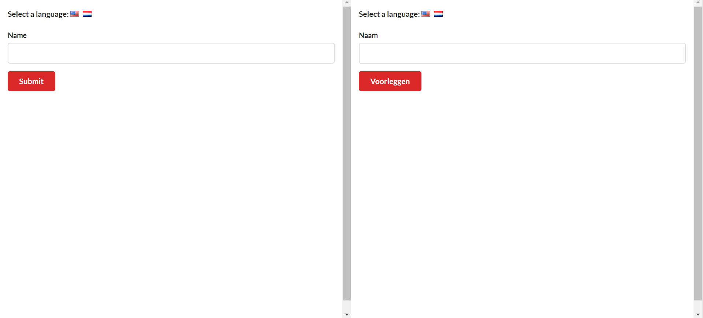

# Translate project - Replacing Redux with Context

-Show input field label and button text in English or Dutch depends on chosen language.

_Using:_\
[semantic-ui cdnjs](https://cdnjs.com/libraries/semantic-ui)

```
create-react-app translate
cd translate
code .
npm start
```

