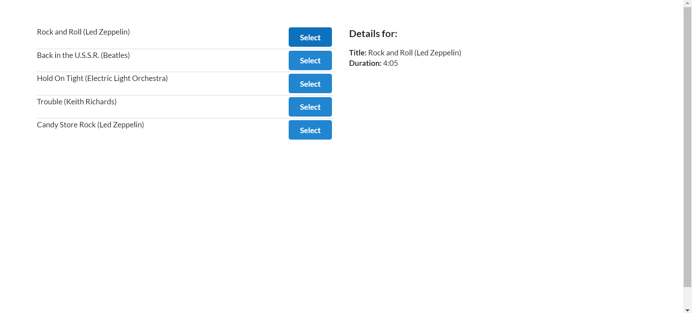

**Blog posts - React-Redux with redux-thunk**

-Show list of posts.\
-Understand the purpose of reducers.\
-Understand making API requests with Redux.\
-Understand the purpose of 'redux-thunk'.

_Using:_\
[React-Redux GitHub](https://github.com/reduxjs/react-redux)\
[axios](https://www.npmjs.com/package/axios)\
[Redux Thunk](https://github.com/reduxjs/redux-thunk)\
[semantic-ui](https://semantic-ui.com/elements/list.html)\
[semantic-ui cdn](https://cdnjs.com/libraries/semantic-ui)\
[JSONPlaceholder API](https://jsonplaceholder.typicode.com/)\
[Lodash](https://lodash.com/docs/#memoize)

```
create-react-app my-app
npm install --save redux react-redux axios redux-thunk
npm install --save lodash
```


