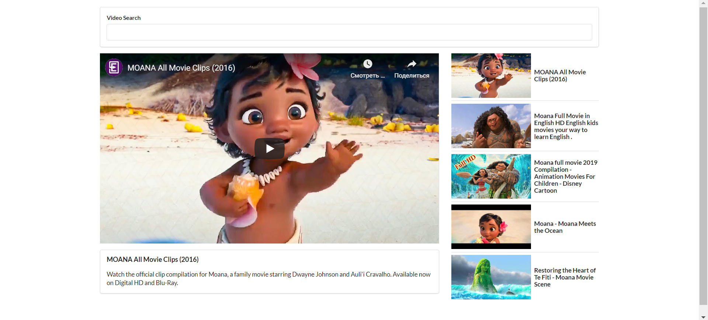

**YouTube video search application**

-Get a search term from the user.\
-Use this search term to trigger a search request from YouTube free API.\
-With YouTube API we going to do a search for a list of videos matching with this search term.\
-Show a video list on the screen.\
-Show a selected video.

_Using:_\
[axios](https://github.com/axios/axios)\
[Google Developers Console](https://console.developers.google.com/)\
[YouTube API Search](https://developers.google.com/youtube/v3/docs/search/list)\
[semantic-ui css](https://cdnjs.com/libraries/semantic-ui)

```
npm install axios@0.18.1
```


