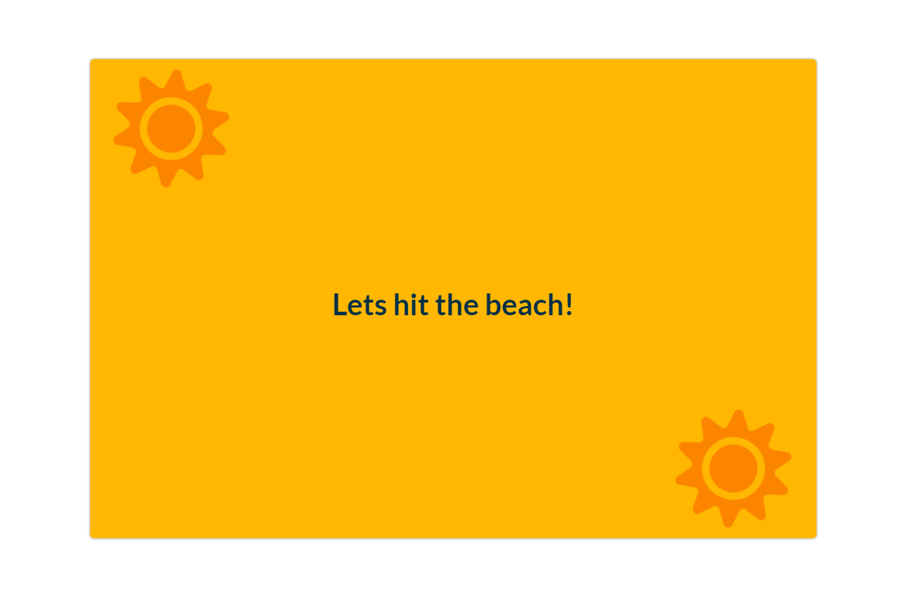

# Seasons project with Hooks system

-Show winter or summer season, depends on location.<br />

_Using:_\
[Geolocation API](https://developer.mozilla.org/en-US/docs/Web/API/Geolocation_API)\
[Geolocation.getCurrentPosition()](https://developer.mozilla.org/en-US/docs/Web/API/Geolocation/getCurrentPosition)

get **Seasons Project**

```
cd seasons-hooks
npm i
npm start
```


