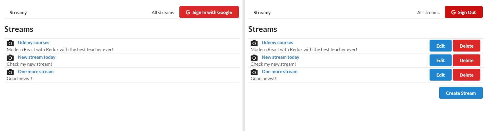

# Stream videos project

-Navigation with React Router.\
-LogIn with Google.\
-CRUD\
-Show list of streams.\
-Show particular stream details.\
-Options with my streams: Create / Edit / Delete stream.



_Using:_

[semantic-ui](https://semantic-ui.com/elements/list.html)\
[semantic-ui cdn](https://cdnjs.com/libraries/semantic-ui)\
[react-router-dom](https://github.com/ReactTraining/react-router/tree/master/packages/react-router-dom)\
[OAuth](https://developers.google.com/identity/protocols/oauth2/scopes)\
[Google Developers Console](https://console.developers.google.com/)\
[GAPI Documentation - Authentication](https://developers.google.com/identity/sign-in/web/reference#authentication)\
[React-Redux GitHub](https://github.com/reduxjs/react-redux)\
[Redux DevTools Extension](https://github.com/zalmoxisus/redux-devtools-extension)\
[Redux Dev Extension - Advanced store setup](https://github.com/zalmoxisus/redux-devtools-extension#12-advanced-store-setup)\
[Redux Form](https://redux-form.com/8.3.0/)\
[Synchronous Validation](https://redux-form.com/8.2.2/examples/syncvalidation/)\
[JSON Server](https://www.npmjs.com/package/json-server)\
[axios](https://www.npmjs.com/package/axios)\
[Redux Thunk](https://github.com/reduxjs/redux-thunk)\
[Lodash \_.omit()](https://lodash.com/docs/4.17.15#omit)\
[Lodash \_.mapKeys()](https://lodash.com/docs/4.17.15#mapKeys)\
[Lodash \_.pick()](https://lodash.com/docs/4.17.15#pick)

### client

```
mkdir streams
cd streams
create-react-app client
ls
cd client
code .
npm start

npm install --save react-router-dom
npm install --save redux react-redux
npm install --save redux-form
npm install --save axios redux-thunk
npm install --save lodash

```

### api

-In new terminal window create a server folder in a streams project:

```
cd ..

ls
$ client

mkdir api
cd api
npm init

ls
$ package.json

npm install --save json-server
code .
npm start
```

-Add to _public/index.html_ :

```
  <link rel="stylesheet" href="https://cdnjs.cloudflare.com/ajax/libs/semantic-ui/2.4.1/semantic.min.css" />
  <script src="https://apis.google.com/js/api.js"></script>
```

_Debug session_ - Redux Devtools persist all actions and state across refresh:

```
http://localhost:3000/?debug_session=<some_string>
```
